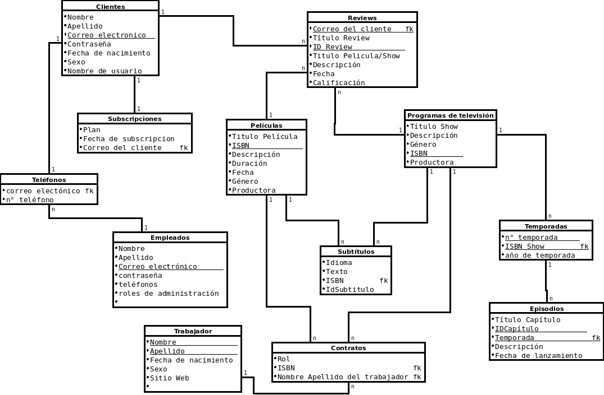

contrato# Práctico I

## Diseño de Bases de Datos Relacionales

1. Listar los datos de los clientes suscritos al plan PREMIUM con una determinada fecha de suscripción.

Cliente

- Nombre
- Apellido
- Correo electrónico
- Contraseña
  |
  ↓ tiene una suscripción 1...1
- Suscripción
  - Plan: PREMIUM
  - Fecha de suscripción

2. Listar los datos de las películas donde el actor 'X' fue protagonista
   Relación de mucho a muchos

| Pelicula   | 1.. \* ←→ | contrato                | ←→ \*.. 1 | Actor               |
| ---------- | --------- | ----------------------- | --------- | ------------------- |
| titulo     |           | rol (actor/director/..) |           | nombre              |
| descipcion |           | sueldo                  |           | apellido            |
| duracion   |           | etc                     |           | fecha de nacimiento |
| fecha      |           | **IDpelicula** pk       |           | sexo                |
| generos    |           | **IDActor** pk          |           | sitio web           |

3. Listar los episodios correspondientes a un programa de televisión X y un número de temporada N. Listar ordenados por fecha de lanzamiento

Programa de television

- Título
- Descripción
- genero
  ↓ tiene temporadas (1..\*) ↓↓ tiene contratos (1..\*) (puede ser el mismo que de película) ↓↓↓ tiene reviews
  Temporadas
- Numero de temporada
- año de temporada
  ↓ tiene episodios
  Episodios
- Título
- descripción
- duración
- fecha de lanzamiento

4. listar los reviews hechos por un cliente X dentro de un rango de fechas

review

- cliente
- titulo
- descripción
- fecha
- calificación

5.  Dada una película X, calcular su "calificación promedio" listo
6.  Listar las películas por dos o más directoras femeninas

