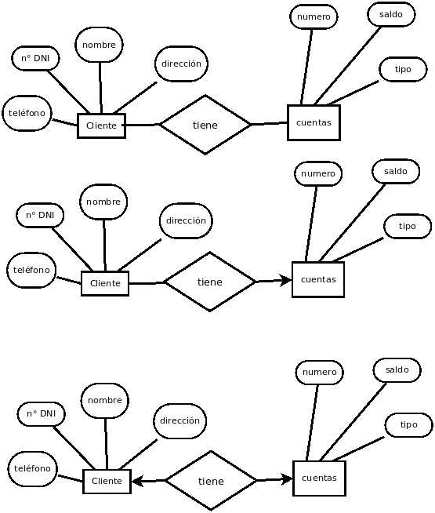

# Práctico 1
1.  *Se quiere diseñar una base de datos para un banco, incluyendo información de los clientes y cuentas. La información del cliente abarca: nombre, dirección, teléfono y número de DNI; mientras que las cuentas tienen: número, saldo y tipo (caja de ahorro, cuenta corriente, plazo fijo). Dar el diagrama E/R para cada uno de los siguientes casos:*
	1.  Una cuenta puede tener más de un dueño, y un cliente más de una cuenta.    (relación varios a varios)
	2.  Una cuenta puede tener sólo un cliente. (un cliente puede tener mucas cuentas. Uno a varios)
	3.  Un cliente puede tener sólo una cuenta. (uno a uno)


2.  *La Secretaría Académica de una universidad mantiene datos acerca de las siguientes entidades:*
	1.  Materias: incluyendo el número, título, programa y **correlatividades**.
	2.  Ofertas de materias: incluyendo el número de la materia, año, semestre, código de oferta, **profesor**(es), horarios y aulas.
	3.  Estudiantes: incluyendo número de matrícula, nombre y carrera,
	4.  Profesores: incluyendo número de legajo, nombre, departamento y cargo. 

*Además la inscripción de los estudiantes en materias y las notas concedidas a estudiantes en cada materia en la que están inscriptos se deben modelar adecuadamente. Construir un diagrama E/R para la oficina de registro. Documentar todas las decisiones que se hagan acerca de restricciones de correspondencia.*
| entidad | debil o fuerte | atributos | comentario |
| --------| -------------- | --------- | ---------- |
| materias | fuerte | número, titulo, programa | que se hace con las correlativas?? |
| estudiantes | fuerte | n° matricula, carrera, nombre | 
| oferta de materias | débil? | n° materia, cod oferta, horario, semestre, año, aula |


Oferta de materias: entidad débil.
Notas: entidad débil que depende de materia y estudiantes

3.  Construir un diagrama de E/R para una compañía de seguros de autos cuyos clientes (con DNI y nombre) poseen uno o más autos (cada uno con número de patente, marca y modelo). Cada auto tiene asociado un número de cero a cualquier valor de accidentes almacenados. Además hay pólizas de seguro con número de póliza y tipo de cobertura (por ejemplo: robo, incendio, etc.) Cada póliza de seguro cubre uno o más autos y tiene uno o más pagos asociados con ella. Cada pago tiene un monto, es por un período particular de tiempo y tiene asociado una fecha de vencimiento y la fecha cuando el pago fue recibido. 

4.  En el ejercicio anterior, ¿es razonable considerar accidentes como atributo de auto? ¿Qué información se le ocurre que sería relevante sobre los accidentes? ¿De qué manera se debería adecuar el diseño? 

5.  Se quiere mantener una base de datos para el área de obstetricia de un hospital. Un bebé es identificado por una hora y fecha de nacimiento. Cada bebé es el resultado de un nacimiento único; cada nacimiento es de un bebé (los gemelos serán representados por 2 nacimientos); cada bebé tiene una única madre (con nombre y DNI); para cada nacimiento hay une únique doctore (con nombre, número de matricula y DNI); además existen algunes enfermeres (cada une con nombre y DNI) que asisten a le doctore. ¿Es razonable suponer que une misme doctore es acompañado siempre por les mismes enfermeres? ¿De qué manera impacta la respuesta a esa pregunta en el modelo?

6.  Asumimos que se hace una base de datos para una universidad. En una facultad que dicta cursos se quiere modelar una base de datos. Cada facultad está identificada por su nombre. Un curso es dado por un único departamento, pero su único atributo es su número. Diferentes departamentos pueden ofrecer cursos con el mismo número. Cada departamento tiene un único nombre. Identificar las claves de las entidades fuertes y débiles involucradas.


7.  Diseñar el diagrama E/R e identificar las claves primarias y candidatas para la siguiente base de datos. Se debe construir una base de datos para un hospital. De une paciente se tiene que saber el nombre y sexo, la fecha de nacimiento, y su edad. Une paciente se diferencia unívocamente de otre por su número de historia clínica. Une doctore se identifica por su número de matrícula, y también se quiere almacenar su DNI y nombre. Una habitación tiene un número de identificación, un piso correspondiente y una o más camas numeradas. Se podría tener por ejemplo una cama 3 en la habitación 666 y una cama 3 en la habitación 911. Se necesita saber que camas están ocupadas o libres. Una internación tiene asociada una fecha y la cama del paciente. A cada paciente internade se le asigna une únique doctore que lo atiende en un horario fijo; cada doctore puede atender varies pacientes.

8.  El siguiente diagrama E-R tiene algunos errores. Se pide identificarlos y corregirlos; además seleccionar las claves primarias y discriminadores adecuados para cada uno de los conjuntos de entidades. Luego pasar a tablas el modelo resultante, prestando especial atención a que modele adecuadamente lo esperado.


Figura 1: Diagrama con errores.

9.  Construir tablas apropiadas para cada uno de los diagramas E-R de los ejercicios 4 y 2. 

10.  Considerar el diagrama en la figura 2 que modela una librería en línea.
	1.  La librería está expandiendo su colección con discos DVD, Blu-ray y videos descargables. Estos nuevos ítems son provistos por une proveedore, que tiene la misma información que la editorial. Igual que los libros, estos productos tienen autores, año, y titulo. Los DVD y los Blu-ray se distinguen por código de barras, y los videos por URL. El mismo ítem puede estar presente en uno o en ambos formatos, con diferentes precios. Extienda el modelo E-R para modelar esta adición. Notar que los DVD y los Blu-ray también se guardan en el depósito. 
	2.  Traducir a tablas el diagrama E/R obtenido. 


  
11.  Diseñar una jerarquía de especialización-generalización para las ventas de una compañía de vehículos a motor. Un vehículo a motor tiene un número de patente, marca, modelo, antigüedad, cantidad de cilindros, kilometraje y precio. La compañía vende motocicletas, autos, furgonetas y ómnibus (con tamaño y cantidad de asientos). Los autos y las furgonetas tienen accesorios (p.ej. gps, apoya cabeza, aire acondicionado, etc.). Diseñe y justifique la colocación de los atributos en cada nivel de la jerarquía. Explicar por qué se deberían colocar en un nivel más alto o más bajo.

12.  Considerar la siguiente base de datos relacional: empleado(nombre-empleado,calle,ciudad) trabaja(nombre-empleado,nombre-empresa,sueldo) empresa(nombre-empresa,ciudad) 
	1.  El atributo nombre-empleado, ¿incluirá también el apellido?.    
	2.  La persona que diseñó esta base de datos, ¿previó la posibilidad de que haya dos empleados de igual nombre en una misma ciudad? ¿Y en distintas ciudades? ¿Y en una misma empresa? ¿Y que una misma persona sea empleada de varias empresas? 
	3.  ¿Cuáles serían las claves primarias apropiadas? 
	4.  ¿Cuáles son las falencias de este diseño? ¿Cómo subsanarlas? 

13.  Dada la base de datos universitaria donde ya se han subrayado las claves primarias:
```
aula(edificio, aulaNro, capacidad) 
facultad(nombreFacultad, edificio, presupuesto) 
curso(idCurso, título, nombreFacultad, créditos) 
profe(ID, nombre, nombreFacultad, salario)
actividad(idCurso, idAct, semestre, año, edificio, aulaNro, idDurClase) 
```
1.  ¿Qué información contiene la relación aula? ¿Es posible que haya aulas con el mismo número en edificios diferentes? ¿Es posible que tengan capacidad para diferente cantidad de alumnos?
2.  ¿Qué información contiene la relación facultad? ¿Cuántos edificios puede tener una facultad?
3.  ¿Puede una misma facultad tener varios cursos con el mismo título? ¿Puede un mismo profesor trabajar en varias facultades? ¿Puede una misma actividad dictarse varias veces al año? ¿Y en un mismo semestre? ¿Puede una misma actividad ser parte de varios cursos?
4.  ¿Puede una misma actividad que se dicta como parte de un curso dado, durante un año dado y un semestre dado dictarse los martes en un aula y los viernes en otra?

14.  Se agrega a la base de datos universitaria del ejercicio anterior las siguientes relaciones:
```
enseña(ID, idCurso, idAct, semestre, año) 
estudiante(ID, nombre, nombreFacultad, total de créditos) 
toma(ID, idCurso, idAct, semestre, año, nota) 
supervisor(IDe, IDp) 
horarios(idDurClase, día, horaInicio, horaFin)
correlativa(idCurso, idPre-requisito)
```

1.  ¿Qué información contiene cada una de las relaciones enseña, toma, horarios y correlativa?    
2.  ¿En cuántas facultades puede estar inscripto un estudiante? ¿Puede tener varios supervisores?

15.  Dada la siguiente BD relacional realice el modelo E/R que la representa. Tenga bien presente las restricciones que el modelo explicíta, y las que no, indique por qué decidió resolverlas de la manera en que lo hizo. 
```
empleadx(dni, nombre, apellido, fechanacimiento, dirección, sueldo, superdni, deptoid) FK superdni FROM empleadx(dni), FK deptoid FROM departamento(id) 
directorx(dni) FK dni FROM empleadx(dni) 
jefx_proyecto(dni) FK dni FROM empleadx(dni) 
departamento(id, nombredpto, numerodpto, dnidirectorx, fechaingresodirectorx) FK dnidirectorx FROM directorx(dni) 
tel_depto(deptoid, teléfono) FK deptoid FROM departamento(id) 
proyecto(numproyecto, nombreproyecto, deptoid, jefxdni) FK deptoid FROM departamento(id), FK jefxdni FROM jefx_proyecto(dni) 
proyecto_tarea(numproyecto, numtarea, descripción) FK numproyecto FROM proyecto(numproyecto) 
trabaja_en(empleadoid, numproyecto, horas) FK empleadxid FROM empleadx(dni), FK numproyecto FROM proyecto(numproyecto) 
```

Responda, según el diagrama: ¿Debe unx jefx de proyecto estar a cargo de las personas que están en el proyecto? ¿Cómo debería cambiar para agregar o quitar esta restricción? 

16.  Responda:
1.  Dadas las tablas del ejercicio anterior, ¿qué pasa cuando no tengo la clave foranea (FK) de superdni a empleado.dni?    
2.  ¿Qué es una restricción de dominio? Indique con un ejemplo qué podría pasar si no se tuviera tal restricción.
3.  ¿En qué se diferencia la integridad de entidad de la entidad referencial, y cómo se traducen a restricciones en la base de datos?
